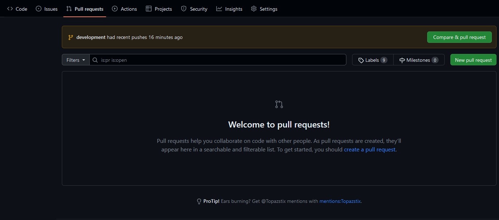
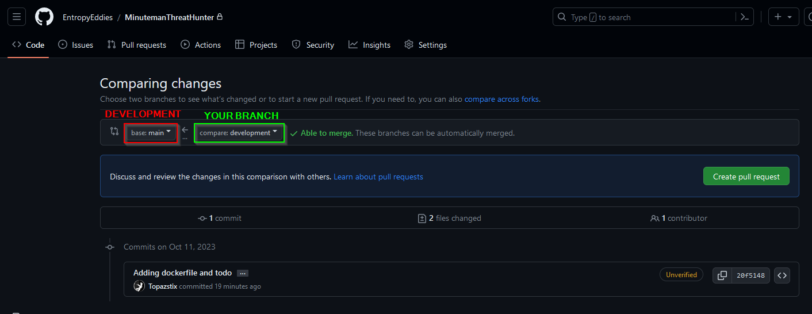
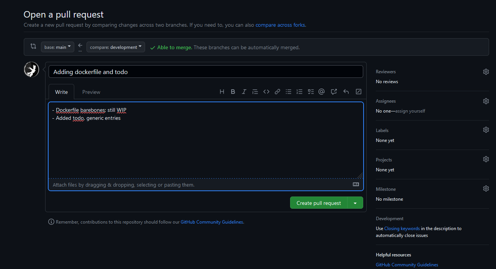

# DEVELOPMENT:

:warning: Please read the how-to-git before contributing! :warning:

## How to git

You will **NOT** push to development or main branches directly. You will be cloning the development branch, checking out a new branch ***LOCALLY***, and then submitting pull requests to the development branch from your local branch.

### 1. Clone the repository

- Clone the repository and specific branch to your machine

```bash

git clone --branch development https://github.com/EntropyEddies/MinutemanThreatHunter.git
```

### 2. Create a new branch

```bash

git checkout -b development_{USERNAME}
```
> Where {USERNAME} is your username, no curly braces. 

> An example would be `git checkout -b development_topaz`

### 3. Make changes

- Make changes to the code, add files, etc.

### 4. Commit changes

- Commit your changes to your local branch
- When making commits, be as descriptive as possible in your commit message

```bash

## In the root of the repository
git add .

git commit -m "Descriptive explanation of changes"

## OR, remove the `-m` flag to open a text editor to write your commit message
git commit ## This will open text editor
```

### 5. Push changes to your branch

```bash

git push --set-upstream origin development_{USERNAME}
```
> Where {USERNAME} is your username

> Example: `git push --set-upstream origin development_topaz`

:warning: The `--set-upstream` flag is only required the first time you push to a new branch. After that, you can just use `git push origin {BRANCH_NAME}`

### 6. Submit a pull request

- Go to the repository on [GitHub](https://github.com/EntropyEddies/MinutemanThreatHunter)
- Click on the `Pull requests` tab
    - 
- Click on the `New pull request` button
- In the two dropdown tabs select `development` as the base branch and `development_{USERNAME}` as the compare branch
    - 
- Click on the `Create pull request` button
- Add a descriptive title and description of your changes
- Click on the `Create pull request` button
    - 
- **TADA!** You have submitted a pull request! :tada:

### 7. Wait for approval

- Ping me on Discord to let me know you have submitted a pull request